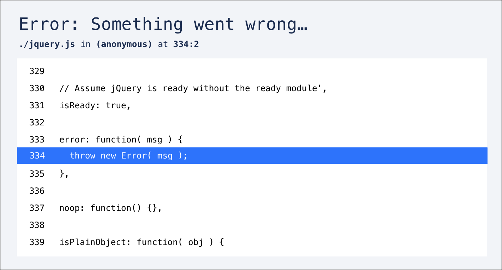

# sentron-sourcemap-service

This service uses sourcemaps to generate a multi-line source extract from an error's stack trace.

It turns this:

```
Error: Something went wrong…
   https://cdnjs.cloudflare.com/ajax/libs/jquery/3.5.1/jquery.min.js:2:2583
```

Into this:



**NOTE to DD :dog:** This service is a Golang port of our Typescript `sourcemap-service` and our **first** attempt at a Golang microservice

It's based on the the [Standard Go Project Layout](https://github.com/golang-standards/project-layout) because it sounded suitably authoritative...

## Setup

Make sure you have the following installed:

- Go 1.15
- Terraform 0.14

## Testing

This service uses the standard `testing` package for unit testing, along with `testify` for assertions.

To run the tests:

```
make test
```

There are also some basic e2e tests:

```
make test-e2e API_KEY=***
```

**NOTE to DD :dog:** We've made this service temporarily available via https://sourcemaps.sentron-int.com so you can try it out for yourself - we'll send you an API key separately

## Deployment

This service is deployed to AWS using [Terraform](https://terraform.io):

```
make deploy # deploys to dev
```

Everything is currently hosted/stored in `eu-west-1`.

## Logs

This service logs to Cloudwatch, and log analysis is done using Cloudwatch Insights.
